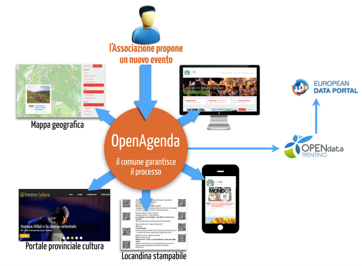
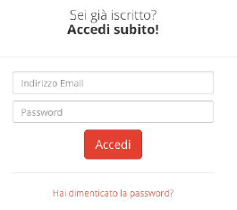
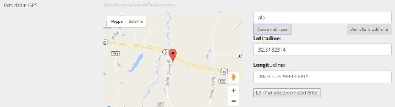
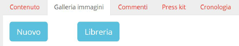
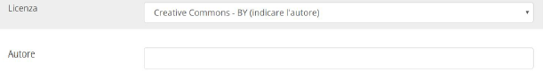
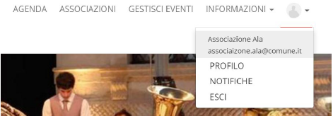

.. toctree::  
    :maxdepth: 2
    :caption: Indice

    index

.. _h6678723070634860455f58573c6c4b26:

OpenAgenda
##########

Manuale per le Associazioni e gli istituti culturali

\ |IMG1|\ 

Con OpenAgenda, la P.A. propone un significativo cambio di paradigma rispetto al passato: rende autonomi e responsabilizza i cittadini nella gestione degli eventi pubblici, mantenendo un ruolo di coordinamento e di validazione dell’intero processo, a garanzia del suo corretto funzionamento.

.. _h1042773592ba34567d94c2f191f40:

Modalità di accesso
*******************

Il calendario è visibile al link: 

:: 

   http://www.sito-ente.it/eventi 

L'associazione, utilizzando le credenziali fornite dall’Ente (login, password), può accedere al sistema attraverso il pulsante ACCEDI (in alto a destra).

\ |IMG2|\ 

Utilizzando il link “Hai dimenticato la password?” può essere impostata immediatamente una nuova password, seguendo la procedura indicata sul sito.

|

.. _h3622673b51a154d504536f601c7b1:

Caricare un evento
******************

\ |IMG3|\ 

Per creare un nuovo evento, serve accedere alla voce di menu “\ |STYLE0|\ ” e qui utilizzare il pulsante verde in alto a sinistra “\ |STYLE1|\ ”.

Qui si aprirà una schermata dove inserire le informazioni rilevanti per il proprio evento, sono suddivise in 4 parti:

* \ |STYLE2|\  : inserire il titolo, una descrizione, informazioni e costi;

* \ |STYLE3|\  : inserire orario e durata dell’evento;

* \ |STYLE4|\  : inserire il luogo dell’evento. Di fondamentale importanza qui è la possibilità di geolocalizzare il proprio evento su una mappa. Per fare questo è sufficiente inserire l’indirizzo nella prima casella di testo e cliccare sul pulsante “ cerca indirizzo”. Automaticamente l’indirizzo verrà segnalato sulla mappa;

\ |IMG4|\ 

* \ |STYLE5|\  : specificare il target utente e l’argomento dell’evento. Importante è inserire tale informazioni per far in modo che i propri eventi siano filtrabili dagli utenti dell’agenda e siano più facilmente ricercabili.

Per garantire una maggior completezza di informazione, si raccomanda di riempire tutti i campi possibili , inclusi quelli non obbligatori.

Una volta concluso premere sul pulsante verde “\ |STYLE6|\ ” in basso a destra; l’evento potrà essere modificato dalla stessa associazione (in caso di refusi), fino a che l’Ente non lo prenderà in esame.

Il referente dell’Ente provvederà, in tempi brevi, ad esaminare i contenuti inseriti e ad approvare l’iniziativa proposta, che a quel punto sarà visibile a tutti i cittadini e diffusa su siti esterni.

Una volta volta approvato dal referente dell’Ente, l’evento non potrà più essere modificato

dall’associazione.

|

.. _h28676f6466555184979196d207871:

Che cos’è un’iniziativa e come inserirla?
*****************************************

Un’iniziativa è un possibile gruppi di eventi che fanno parte della stessa raccolta. 

Ad esempio un’iniziativa del “\ |STYLE7|\ ” conterrà tutti gli eventi dei concerti del mese di maggio dell’iniziativa.

Per creare una nuova iniziativa è necessario essere nella fase di creazione di un nuovo evento.

Quindi accedere alla voce di menu “\ |STYLE8|\ ” e qui usare il pulsante verde in alto e sinistra “\ |STYLE9|\ ”. Una volta aperta la successiva schermata dove inserire le informazioni dell’evento. 

Scegliendo il tab categorizzazione, scorrendo verso il basso.

|

.. _h18503c1f695a44246e1d265e30f3e38:

Inserire immagini per gli eventi
********************************

Per inserire le immagini relative ad un evento, una volta creato l’evento, accedere alla sezione “\ |STYLE10|\ ”. Qui identificare l’evento appena inserito e premere sul bottone azzurro “\ |STYLE11|\ ”.

\ |IMG5|\ 

Una volta aperta la nuova schermata del dettaglio dell’evento scegliere tra le 5 voci in alto la voce “\ |STYLE12|\ ”.

Premere quindi sul pulsante blu “\ |STYLE13|\ ” per caricare una nuova immagine dal proprio computer o il pulsante blu “\ |STYLE14|\ ” per riutilizzare un’immagine già presente nell’archivio perché caricata in occasione di altri eventi.

Per ogni immagine è importante, una volta caricata, cliccare sul bottone con l’icona della matita \ |IMG6|\  per modificarne le informazioni principali. In particolar modo è importante completare i campi riguardanti la licenza d’uso della foto e l'autore.

\ |IMG7|\ 

Concludere con il pulsante “\ |STYLE15|\ ” in basso a destra.

Le immagini possono venire modificate anche in seguito alla pubblicazione dell’evento, inclusi i metadati (titolo, autore, ...). 

Si raccomanda di:

* se possibile, evitare che non siano presenti scritte testuali sulle immagini caricate; in alcune visualizzazioni, potrebbero non essere leggibili; 

* applicare sempre la licenza d’uso.

|

.. _h58374b721b7e1b16613f6c306470c5a:

Pianificazione eventi
*********************

Accedendo alla sezione “\ |STYLE16|\ ”, si possono vedere tutti gli eventi approvati e quelli che sono in attesa di approvazione da parte dell’Ente. 

Attraverso il link “\ |STYLE17|\ ” si può avere un’idea più chiara di ciò che è previsto (anche non ancora definitivo) nel corso dei giorni/mesi successivi; questo consentirà di coordinare meglio la pianificazione delle iniziative proposte, in collaborazione con l’Ente e con le altre associazioni.

|

.. _h2d1e6085aa5f7e6b16214d15732c4c:

Aggiornare il proprio profilo
*****************************

Una volta effettuato il primo accesso è importante inserire tutte le informazioni riguardanti la propria associazione come indirizzo, contatti, ... e tenere in seguito tali dati periodicamente

aggiornati.

Per fare questo premere sull’icona del profilo a destra nel menu e selezionare la voce di sottomenù “\ |STYLE18|\ ”.

\ |IMG8|\ 

Qui premere sul pulsante blu “\ |STYLE19|\ ” e compilare la form con tutte le informazioni necessarie. 

Anche in questo caso per garantire completezza di informazione è importante completare la maggior parte dei campi, anche di quelli non obbligatori.

|

.. _h6a181913125c135a74791e6616527680:

Per uscire dal sistema 
***********************

Per uscire dal sistema basta semplicemente premere sull’icona del profilo a destra nel menu e selezionare la voce di sottomenù “\ |STYLE20|\ ”.

|

.. _h797f2878d67663a427217515c49105:

Raccomandazione: policy sui contenuti
*************************************

Aderendo all’iniziativa, l’associazione dichiara di applicare una licenza Creative Commons ai

contenuti inseriti nel calendario (testi ed immagini), pertanto deve assicurarsi di essere il titolare del contenuto o che il titolare del contenuto (es. fotografo) applichi questa stessa licenza ai propri contenuti. Questo favorirà tutte le azioni di diffusione degli eventi che l’Ente si impegna ad effettuare con questo progetto, avvalendosi del paradigma Open Data (ad esempio, pubblicando gli eventi su altri portali istituzionali, locali ed internazionali). 

Maggiori informazioni sulle licenze Creative Commons sono reperibili sul sito: \ |LINK1|\  

.. admonition:: Ultimo aggiornamento del manuale

    26/04/2017

..  seealso:: 

    \ |LINK2|\ 

--------

\ |IMG9|\ 

OpenAgenda è una soluzione applicativa di OpenContent \ |LINK3|\  

.. bottom of content

.. |STYLE0| replace:: **gestisci eventi**

.. |STYLE1| replace:: **crea un nuovo evento**

.. |STYLE2| replace:: **contenuti principali**

.. |STYLE3| replace:: **quando**

.. |STYLE4| replace:: **dove**

.. |STYLE5| replace:: **categorizzazione**

.. |STYLE6| replace:: **Salva**

.. |STYLE7| replace:: *maggio dedicato al rock*

.. |STYLE8| replace:: **Gestisci eventi**

.. |STYLE9| replace:: **crea un nuovo evento**

.. |STYLE10| replace:: **Gestisci eventi**

.. |STYLE11| replace:: **Dettagli**

.. |STYLE12| replace:: **Galleria immagini**

.. |STYLE13| replace:: **Nuovo**

.. |STYLE14| replace:: **Libreria**

.. |STYLE15| replace:: **Salva**

.. |STYLE16| replace:: **Gestisci eventi**

.. |STYLE17| replace:: **Calendario**

.. |STYLE18| replace:: **PROFILO**

.. |STYLE19| replace:: **Modifica profilo**

.. |STYLE20| replace:: **ESCI**

.. |LINK1| raw:: html

    <a href="http://creativecommons.it/Licenze" target="_blank">http://creativecommons.it/Licenze</a>

.. |LINK2| raw:: html

    <a href="https://medium.com/@cirospat/eventi-culturali-del-territorio-raccolti-e-comunicati-in-piattaforma-crowdsourcing-con-opendata-975b6c2766e6" target="_blank">Un articolo su OpenAgenda</a>

.. |LINK3| raw:: html

    <a href="https://www.opencontent.it/Per-la-PA/OpenAgenda" target="_blank">https://www.opencontent.it/Per-la-PA/OpenAgenda</a>

